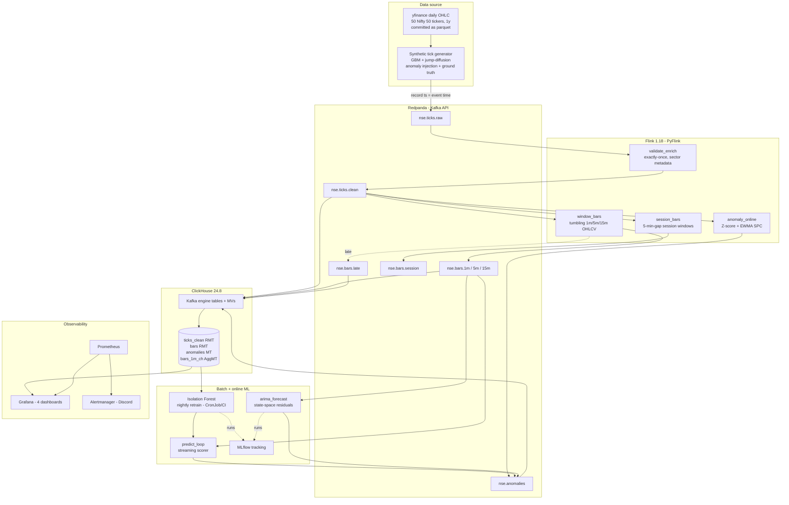

# StreamPulse NSE — System Architecture

## Overview

## Components

| Layer | Technology | Why (ADR) |
|---|---|---|
| Bus | Redpanda 24.2 (Kafka API) | single binary, built-in schema registry + metrics (ADR-001/002) |
| Stream compute | Flink 1.18 + PyFlink, RocksDB, exactly-once | ADR-003, deep-dive doc |
| OLAP | ClickHouse 24.8, Kafka engine + MVs | native ingestion, Replacing/Aggregating MergeTree |
| ML | scikit-learn, statsmodels, MLflow | §14 four-method ensemble |
| Observability | Prometheus + Grafana + Alertmanager | 10 alert rules → Discord |
| Packaging | Docker Compose (dev) + Helm on kind (k8s) | 7 custom charts + umbrella |
| IaC | Terraform (AWS via LocalStack, GCP demo) | docs/cloud-architecture-*.md |

## Event-time contract

Event time = **Kafka record timestamp**, stamped by the generator at produce
and propagated by every Flink sink. Watermarks are per-partition at every
source; replay-speed calibration via `--ooo-seconds` / `--idle-seconds`
submit-time knobs. Full reasoning + the five defects this design fixed:
[streaming-deep-dive.md](streaming-deep-dive.md).

## Deployment topologies

1. **Docker Compose** (`make up`) — the dev loop. 9 containers, ports on a
   dedicated 2xxxx block (ADR-006).
2. **kind + Helm** (`make k8s`) — 3-node cluster; umbrella chart wires 7
   subcharts; post-install hooks apply ClickHouse DDL and submit Flink jobs;
   nightly retrain CronJob; HPA on TaskManagers (2→8 on CPU).
3. **AWS parallel** — Kinesis/Lambda/S3/DynamoDB/Glue via LocalStack
   ([cloud-architecture-aws.md](cloud-architecture-aws.md)).
4. **GCP demo cycle** — Pub/Sub → Dataflow (Beam) → BigQuery, ~3 h, then
   destroyed ([cloud-architecture-gcp.md](cloud-architecture-gcp.md)).

## Data persistence & retention

| Table | Engine | Retention |
|---|---|---|
| nse.ticks_clean | ReplacingMergeTree(_ingested_at) | 30 days |
| nse.bars | ReplacingMergeTree(_ingested_at) | 2 years |
| nse.bars_1m_ch | AggregatingMergeTree | 2 years |
| nse.anomalies / anomalies_ml | MergeTree | 1 year |
| nse.bars_late | MergeTree | 7 days |
